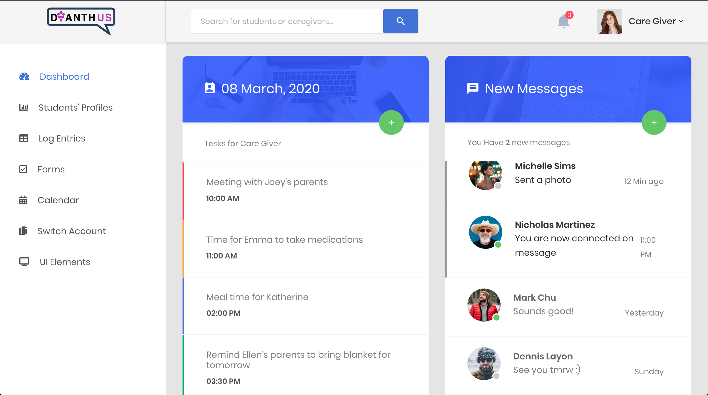

## Inspiration
Our team has extensive experience working with children with special needs, especially those on the autism spectrum. Often, the biggest barrier to being an effective teacher or caregiver is lack of information about the particular child, since each child's needs are highly specific and unique. For example, when new caregivers take over, the child transfers facilities, or current caregivers are not able to come in for a day, communication is vital to ensuring quality care for their specific needs. This information is currently passed on by word-of-mouth (however, it is not always possible to talk with the parents or previous caregiver) or through a physical note (which can be easily misplaced, or missing important information).

Thus, we created an application to address these problems.We named it after the Dianthus flower: a beautiful flower that sometimes needs a bit of extra care to grow and thrive.

## What it does
DianthUS allows parents and teachers/caregivers to create accounts, through which they can create and manage student profiles. Each student profile includes a child's tendencies, needs, abilities, triggers, and other relevant information that the child may not be able to tell an adult verbally. This information includes a historical logbook where parents and caregivers can record the child’s progress, milestones or any incidents. The application also allows for messaging between parents and teachers, allowing for instant communication.

## How we built it
DianthUS was built in Visual Studio Code using HTML, CSS, JavaScript, a Bootstrap, and FireBase API. For version control we used Github and Github Desktop. We collaboratively divided up the work in terms of front-end, back-end, firebase ui and overall design (logo, slogan, etc.). We had a task document that was updated every hour or two hours in order to keep us on track and provide deliverables. 

## Images

Created with the CoolAdmin Bootstrap 4.1 Admin Dashboard Template by [ColorLib](https://colorlib.com/)

